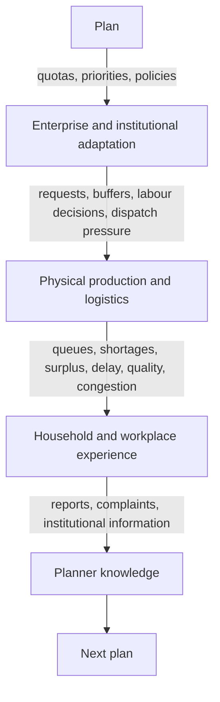

# Vision

**Kind:** concept
**Authority:** advisory
**Status:** draft
**Owner:** project lead
**Last verified:** 2026-08-28

## The thesis

Soviet Simulator is not a city-builder with a socialist skin and not an economy simulator with
quotas on top. Its defining subject is **coordination under physical scarcity**.

The player is THE PLANNER. The Planner does not buy domestic goods through a price-clearing
market. The Planner sets quotas, priorities, allocation policies, construction programmes,
reserves and institutional rules. Goods then have to be produced, stored, loaded, transported,
unloaded, delivered and consumed by real physical and institutional actors.



The planned economy generates its own gameplay. No crisis dice are needed: a taut plan, a bad
reserve policy, an overconfident rail programme, a housing lag, a storming cycle or an unreliable
allocation system is enough to produce difficult, understandable situations. The mechanism is
explained once in [the plan cycle](../simulation/planned-economy/plan-cycle.md).

## The player fantasy

> Turn a fragile, shortage-prone, buffer-hoarding industrial system into a calm, predictable,
> sophisticated republic capable of executing immense national projects without tearing ordinary
> society apart.

Success is **coordination quality**, not gigantism. A mature republic is physically calmer:
smaller emergency reserves, fewer emergency dispatches, shorter queues, lower plan-period
variance, more reliable deliveries, lower turnover, less overtime, more accurate reports, more
household discretionary time. See [reliability](../simulation/concepts/reliability.md) for why
calm is the observable form of maturity.

## The long arc

```text
fragile local economy
→ integrated industrial republic
→ sophisticated planned economy
→ a state that can execute enormous national projects
```

The charter's three authored Plans on one continuous save are the first rungs; the procedural
endless mode and the [game modes](game-modes.md) are the replayability layer after them.

## Lineage and difference

Cities: Skylines II sets the bar for urban scale and design. Workers & Resources: Soviet Republic
sets the bar for physical planned-economy causality and is installed locally as the reference
implementation (its campaigns are scenarios over one rule set; it has no organisational modes;
its utilities are binary connectivity, not pressure). Dwarf Fortress sets the bar for persistence
and causal depth. This game's own additions, found in no competitor: persistent individual
citizens at 250k scale, the four realities of information, the dishonest enterprise as the loop,
and institutions as a sensor network rather than a politics meter.

Frostpunk is often cited as an influence; note that Frostpunk *does* have game over. "Never game
over" is this project's own decision, and it means pressure must come from visible degradation the
player cannot ignore, not from the threat of termination.

## What this vision is not

It is not scope. The [charter](../plan/charter-1.0.md) binds scope, and much of the vision —
game modes, gas linepack, passenger transit, unions, elections — is explicitly
[Post-1.0](post-1.0.md). It is not mechanism; that is the specifications' job. It is the reason
the mechanisms exist.

## Related

- [Design laws](design-laws.md)
- [The Planner](player-role.md)
- [Simulation philosophy](simulation-philosophy.md)
- [Causal loops](../simulation/causal-loops.md)
- [Charter](../plan/charter-1.0.md)
- [Mining synthesis](../research/conversation-mining-2026-08-28/SYNTHESIS.md) — provenance of this vision
